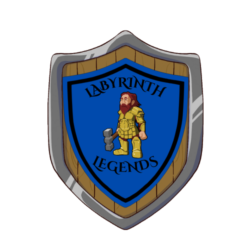

# Labyrinth Legends - GMD1 Project - Spring semester 2024

  

## Game Concept
"Labyrinth Legends" is a maze exploration game where players navigate labyrinths filled with traps and enemies. The game combines elements of strategy, reflexes, and problem-solving to create an engaging and challenging experience.

### Genre
- Action
- Puzzle

### Target Audience
Intended for ages 10 and up

### Project Scope
The scope of the project is to develop a functioning version of he game with core gameplay mechanics, including maze exploration, combat and puzzle-solving.

## Gameplay
### Objectives
The main objective of "Labyrinth Legends" is to navigate through maze levels, defeat enemies, solve puzzles, and reach the exit while collecting treasures and power-ups along the way. Players must use their skills and strategic thinking to overcome obstacles and challenges in each level.

### Game Progression
As players progress through the game, they unlock new levels, costumes, and upgrades. The difficulty gradually increases with each level, introducing more complex mazes, traps, and enemies to overcome.

### GUI
The game will feature an intuitive and user-friendly GUI that displays essential information such as player health, inventory and (possibly) a map. The GUI design focuses on providing clear feedback and easy navigation for players.

## Mechanics
### Rules
Players must navigate through maze levels while avoiding traps and defeating enemies. They can collect power-ups to enhance their abilities and unlock new features as they progress. Combat involves timing, positioning, and strategic use of power-ups.

### Combat
Combat in "Labyrinth Legends" requires players to use a combination of melee attacks, ranged attacks, and special abilities to defeat enemies.

### Physics
The game utilizes physics-based mechanics for player movement, object interaction, and environmental effects. 

## Game Elements

### Visual style
The game will use a combination of 2D and 3D assets for maze layouts, character models, enemy sprites, environmental props, and special effects.

